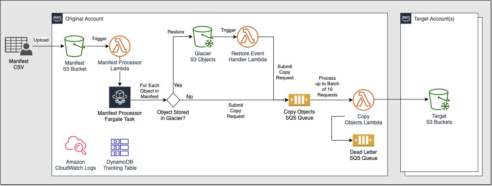
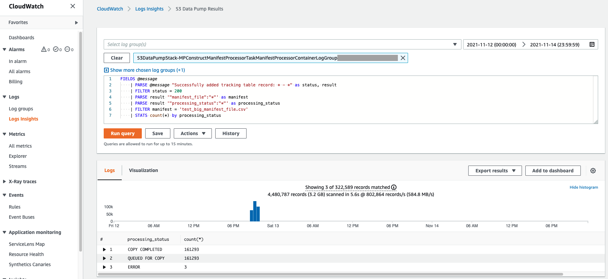

# S3 Data Pump

This solution enables quick movement of large collections of S3 objects among buckets.

Here are some features of this solution:
* Multiple source and target S3 buckets
* Handles Glacier restore for source objects
* Reduces time when source Glacier objects need to be in standard storage tier
* Handles objects larger than 5 GB in size via multi-part copy
* Copies existing metadata and tags for all objects
* Enables additional tags to be added during copy process
* Infrastructure-as-code enables easy deployment and maintenance
* Simple manifest file input
* Serverless for cost savings

Existing hosted AWS solutions such as S3 Batch Operations do not solve these requirements.
Those solutions only support a single source and target S3 Bucket.  They also don't handle
files larger than 5 GB in size.

This solution is provided as-is with no expressed warranty.

## Architecture


## Deployment
Deployment of the solution uses the AWS CDK.  This enables quick deployments that are reliable and repeatable.

### Prerequisites
The following must be installed on your system to do the deployment:
* [NodeJS v14.x](https://nodejs.org/en/download/)
* [AWS CLI vlatest](https://docs.aws.amazon.com/cli/latest/userguide/install-cliv2.html) -
  configured with the credentials for the AWS target account for the deployment
* [Docker vlatest](https://docs.docker.com/get-docker/)

### Configuration
Edit the file 'cdk.context.json' to customize the solution for your environment.
* SourceS3Buckets - (REQUIRED) Enter all the S3 bucket names from which objects will be copied.  Permissions will be granted for read, restore, and tagging objects.
* TargetS3Buckets - (REQUIRED) Enter all the S3 bucket names to where objects will be copied.  Permissions will be granted for putting objects.
* QueueVisibilityTimeout - How long messages will be locked for processing.  After which, the messages will be put back into the queue.
* MaxQueueRetries - How many times a message will be retried if it fails to be processed. 
* ManifestLambdaTimeout - Timeout duration in seconds for the Manifest Lambda that will trigger the Fargate task.
* ManifestFargateVpcCidr - CIDR used for the VPC where the Fargate task will be deployed.
* ManifestFargateCpu - Amount of CPU allocated to the Fargate task.
* ManifestFargateMemory - Amount of memory allocated to the Fargate task.
* RestoreEventLambdaTimeout - Timeout duration in seconds for the Lambda triggered when an object is restored.
* CopyLambdaTimeout - Timeout duration in seconds for the Lambda that performs the copy operation.
* CopyLambdaBatchSize - How many objects a single copy Lambda will process in parallel.
* CopyLambdaMaxBatchingWindow - Duration in minutes before a copy Lambda is trigged if less than the batch size is available in the queue.
* GlacierRestoreTier - Glacier restore tier used for restoring Glacier objects.
  Valid values are:  'Bulk', 'Standard', or 'Expedited'
* GlacierRestoreDays - How long objects will be kept in standard tier once they've been restored from Glacier.

NOTE:  If you make any changes to these configuration settings after the solution has been deployed, you must redeploy for those changes to take effect.

### Steps
From the root directory of this project, run the following commands to install the dependencies and build the project:
```
npm install
npm run build 
```

If this is the first time using the AWS CDK in your AWS account, run this command to initialize the environment:
```
npm run cdk bootstrap
```

Finally, run this command to deploy the solution to your AWS account:
```
npm run cdk deploy
```

### Cross-Account Setup
If the S3 objects will be copied to a different AWS account, you must complete some additional steps.
 
#### Bucket permissions
The target S3 account must grant permissions to the account where this solution is running.
Granting permissions via ACL's using the canonical account ID does not grant the necessary permissions to apply tags.
Therefore, the recommended approach is to create a bucket policy like this for each cross-account target bucket:
```
{
    "Version": "2012-10-17",
    "Statement": [
        {
            "Sid": "Grant S3 cross-account access",
            "Effect": "Allow",
            "Principal": {
                "AWS": "<<ARN of the copy Lambda role>>"
            },
            "Action": [
                "s3:GetObject*",
                "s3:PutObject*"
            ],
            "Resource": "arn:aws:s3:::<<Target S3 Bucket Name>>/*"
        }
    ]
}
```
NOTE: The ARN for the copy Lambda role must be replaced by the Role created by the CDK deployment.
In addition, the ARN for the target S3 bucket name must be set.

#### Object Ownership
The default behavior of S3 is the AWS account that creates an S3 object is the owner of that object.
Since this solution copies objects across AWS accounts, the target AWS account should own the new objects.
To ensure this, set the default object ownership on the target S3 buckets following these instructions:
https://docs.aws.amazon.com/AmazonS3/latest/userguide/about-object-ownership.html#enable-object-ownership

## Manifest File
To run the solution, first generate a manifest file.  You can do this by either creating
the file manually, via a script, or via S3 Inventory.

A template file can be found here:  [manifest template](docs/manifest_file_template.csv)

The manifest file must be a CSV file with no spaces before or after the commas.  It must contain
a header row with these columns in the file:
* source_bucket - (REQUIRED) The name of the source S3 bucket.
* source_object_path - (REQUIRED) The object key for the source S3 object.
* source_tags - (optional) Tags that will be applied to the source objects that are successfully copied. 
  Format is 'key=value&key2=value2'.
* target_bucket - (REQUIRED) The target bucket where the S3 object should be copied.
* target_object_path - (optional) Can rename the object, or leave blank to keep same name.
* target_storage_class - (optional) Default storage class is GLACIER, but can override.
  Valid values are:  'STANDARD', 'REDUCED_REDUNDANCY', 'STANDARD_IA', 'ONEZONE_IA', 'INTELLIGENT_TIERING', 'GLACIER', 'DEEP_ARCHIVE', 'OUTPOSTS'
* target_tags - (optional) Additional tags applied to the copied objects.
  Format is 'key=value&key2=value2'.

NOTE:  It's recommended to set 'source_tags' so you can clean up the copied objects once they have been validated.
You can enable a lifecycle policy on the S3 bucket for objects with those tags to delete them post validation.

## Running the Solution
1. Locate the S3 bucket created by the stack for the manifest files.
   This can be found by looking at the resources created by the Cloudformation stack.
2. Upload the manifest file to that S3 bucket.
3. Monitor the DynamoDB status table for the copy status of the objects.
   Search the DynamoDB table for these status values: 
   1. INITIATING
   2. RESTORING
   3. QUEUED FOR COPY
   4. COPY COMPLETED
   5. ERROR
   Query against the 'S3DataPumpResultsManifestGSI' index to see the files in each status for the processed manifest file.
4. Summaries of the processing results can be obtained through CloudWatch Logs Insights.
   
   Select the log groups corresponding to these components:
   1. Manifest Processor Fargate Task
   2. Restore Event Handler Lambda
   3. Copy Objects Lambda
   
   Update the following query with the manifest file of interest and specify your timeframe:
   ```
   FIELDS @message
       | PARSE @message "Successfully added tracking table record: * - *" as status, result
       | FILTER status = 200
       | PARSE result '"manifest_file":"*"' as manifest
       | PARSE result '"processing_status":"*"' as processing_status
       | FILTER manifest = '<<manifest file name>>'
       | STATS count(*) by processing_status
   ```
   This will return the file count that has passed through each status.  All files should land in the 'COPY COMPLETED' status.
5. Validate the files have been copied to the destination bucket.
6. Any issues can be investigated via CloudWatch logs

NOTE:  It's highly recommended you run a small sample batch of files and validate the results before running a large batch.
You must validate files are copied successfully before deleting the source files.  Otherwise, the data will be lost permanently.

## Updating
When new releases of the solution need to be installed, follow these steps:
1. Make a backup copy of your 'cdk.context.json' file
2. Overlay the new version on top of the old version
3. Replace the 'cdk.context.json' file with the backed up version
4. From the root directory of this project, run the following commands:
   ```
   npm install
   npm run build
   npm run cdk deploy 
   ```
5. Validate the solution is working properly by running a test manifest file.

## Uninstalling
From the root directory of this project, run the following command to uninstall the solution:
```
npm run cdk destroy
```
This will remove the CloudFormation stack for your account along with most of the resources.
To avoid losing data, the following resources will not be removed automatically, and you must clean them up manually from your AWS account:
- S3 bucket for manifest files
- DynamoDB table for tracking purposes
- CloudWatch log groups

## Running Tests
You must run the unit and integration tests for any code changes to avoid regressions.

Unit tests can be run using this command:
```
npm run test
```

Integration tests for copy operations can be run by editing the 'test/copy-test.ts' file, then build the project and run this command:
```
node test/copy-test
```